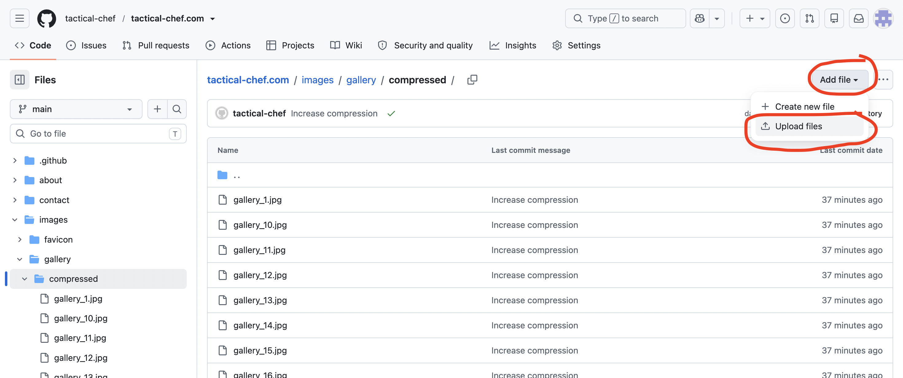
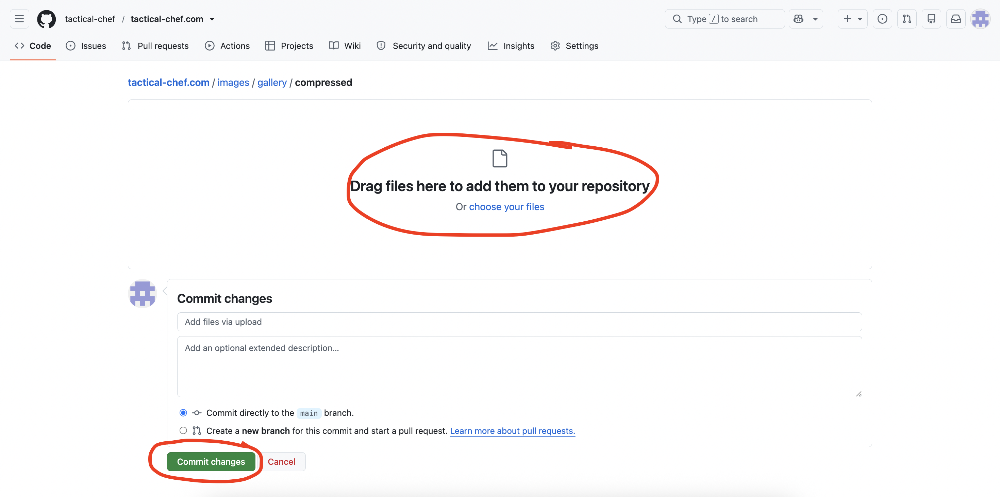
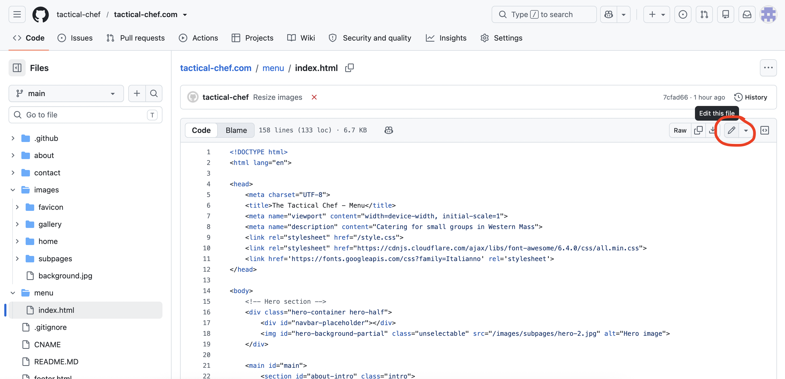
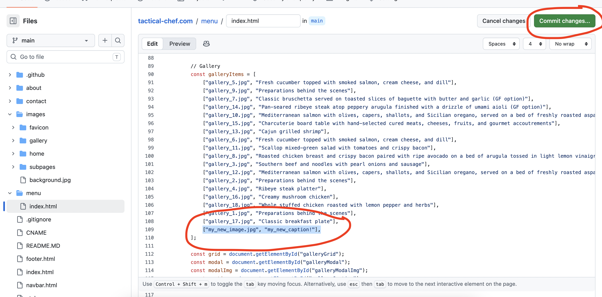

# The Tactical Chef Website

This is the repository storing the files for the website. I set it up so that updating these files will automatically trigger updates on the live site (after ~5-10 minutes).

## Updating the Gallery

To add an image to the gallery:

1. Make sure it is a jpg or png (not HEIC, which is an Apple-only photo format that is not compatible with websites)

2. Add it to BOTH of these folders: [Folder 1](https://github.com/tactical-chef/tactical-chef.com/tree/main/images/gallery/compressed) and [Folder 2](https://github.com/tactical-chef/tactical-chef.com/tree/main/images/gallery/full)
- To upload a file to a folder, when you are in the target folder, click "Add file" > "Upload files"
    - 
- Then upload the photos by dragging or "choose your files", and then click "Commit changes"
    - 

3. Add the caption to the list of captions [in this file](https://github.com/tactical-chef/tactical-chef.com/blob/main/menu/index.html#L90).
- Click the "Edit this file" pencil button in the top right of the screen
    - 
- Scroll down to line 90 where the list of captions is. It looks like this: 

```
const galleryItems = [
    ["gallery_5.jpg", "Fresh cucumber topped with smoked salmon, cream cheese, and dill"],
    ["gallery_9.jpg", "Preparations behind the scenes"],
    ["gallery_7.jpg", "Classic bruschetta served on toasted slices..."],
    
    ...etc
];
```
- Add the caption entry to the bottom in the same format as the existing captions: `["<image_name_with_extension>", "<caption>"],`
- Click "Commit changes..." and then "Commit changes..." again on the popup
    - 

To remove an image from the gallery, delete its entry from the list of [captions](https://github.com/tactical-chef/tactical-chef.com/blob/main/menu/index.html#L90). You don't have to delete the images or anything, just remove it from the list. Same thing: edit the file --> make the changes --> commit changes.